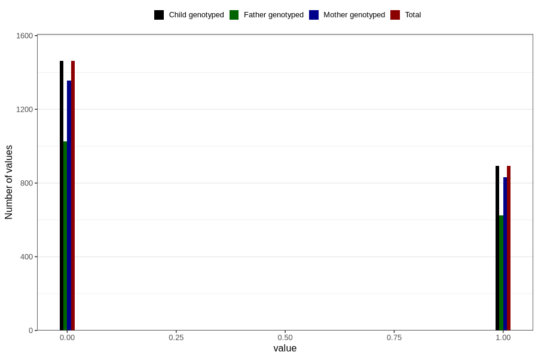

# frequent_stomach_pain_previous_3y
Variable mapping to `GG572` in `Skjema6_3aar_v12`.
- Number of values:

| Value | Total | Child genotyped | Mother genotyped | Father genotyped |
| ----- | ----- | --------------- | ---------------- | ---------------- |
| Missing | 78450 | 78450 | 73838 | 51512 |
| Non-missing | 2356 | 2356 | 2186 | 1651 |
| 0 | 1462 | 1462 | 1356 | 1026 |
| 1 | 894 | 894 | 830 | 625 |

