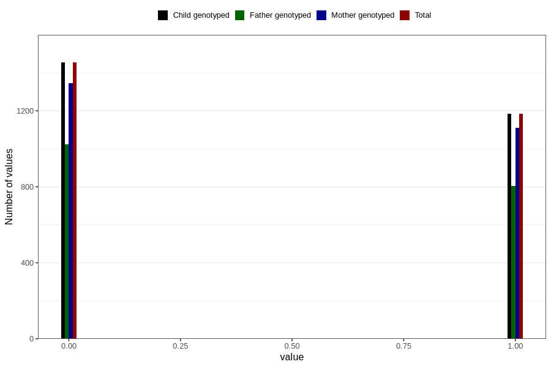

# frequent_stomach_pain_yes_3y
Variable mapping to `GG571` in `Skjema6_3aar_v12`.
- Number of values:

| Value | Total | Child genotyped | Mother genotyped | Father genotyped |
| ----- | ----- | --------------- | ---------------- | ---------------- |
| Missing | 78168 | 78168 | 73569 | 51336 |
| Non-missing | 2638 | 2638 | 2455 | 1827 |
| 0 | 1454 | 1454 | 1346 | 1024 |
| 1 | 1184 | 1184 | 1109 | 803 |

