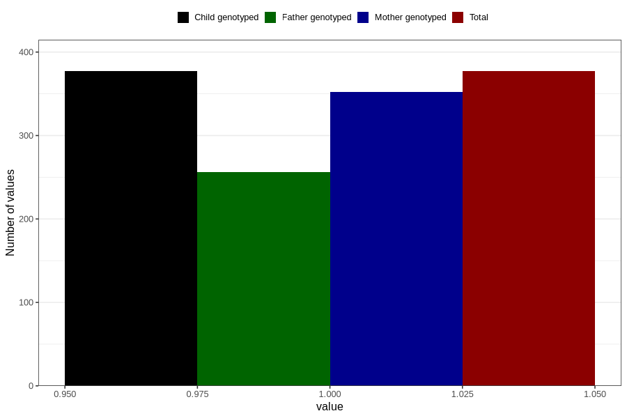

# gained_too_little_weight_yes_3y
Variable mapping to `GG54` in `Skjema6_3aar_v12`.
- Number of values:

| Value | Total | Child genotyped | Mother genotyped | Father genotyped |
| ----- | ----- | --------------- | ---------------- | ---------------- |
| Missing | 80429 | 80429 | 75672 | 52907 |
| Non-missing | 377 | 377 | 352 | 256 |
| 1 | 377 | 377 | 352 | 256 |

