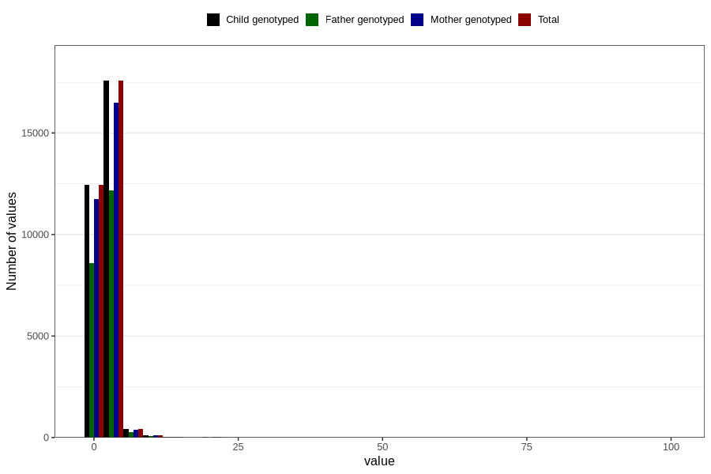

# gastric_flu_diarrhea_freq_3y
Variable mapping to `GG150` in `Skjema6_3aar_v12`.
- Number of values:

| Value | Total | Child genotyped | Mother genotyped | Father genotyped |
| ----- | ----- | --------------- | ---------------- | ---------------- |
| Missing | 50173 | 50173 | 47221 | 31993 |
| Non-missing | 30633 | 30633 | 28803 | 21170 |
| 25th percentile | 1 | 1 | 1 | 1 |
| 50th percentile | 2 | 2 | 2 | 2 |
| 75th percentile | 2 | 2 | 2 | 2 |
| Mean | 2.05043580452453 | 2.05043580452453 | 2.04318994549179 | 2.04615021256495 |
| Standard deviation | 1.95295174638316 | 1.95295174638316 | 1.94731552785101 | 1.74872879526039 |
| N | 30633 | 30633 | 28803 | 21170 |

