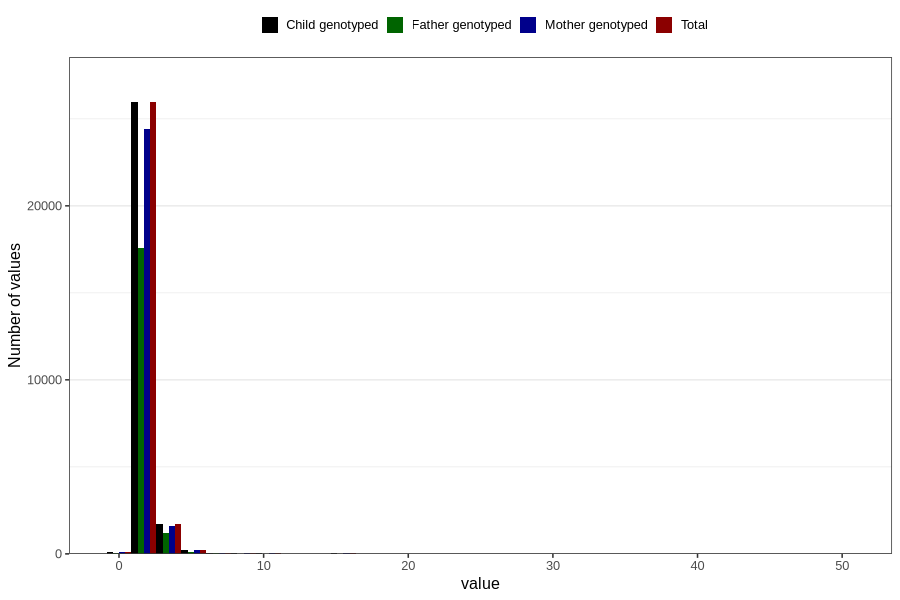

# gastric_flu_diarrhea_number_12_18m
Variable mapping to `EE243` in `Skjema5_18mnd_v12`.
- Number of values:

| Value | Total | Child genotyped | Mother genotyped | Father genotyped |
| ----- | ----- | --------------- | ---------------- | ---------------- |
| Missing | 52645 | 52645 | 49526 | 34130 |
| Non-missing | 28161 | 28161 | 26498 | 19033 |
| Filled in text or mark instead of number | 5 | 5 | 4 |3 |
| 25th percentile | 1 | 1 | 1 | 1 |
| 50th percentile | 1 | 1 | 1 | 1 |
| 75th percentile | 2 | 2 | 2 | 2 |
| Mean | 1.44530473078562 | 1.44530473078562 | 1.44398731788329 | 1.4364161849711 |
| Standard deviation | 1.22338501846577 | 1.22338501846577 | 1.19237086508902 | 1.14905622618368 |
| N | 28156 | 28156 | 26494 | 19030 |

