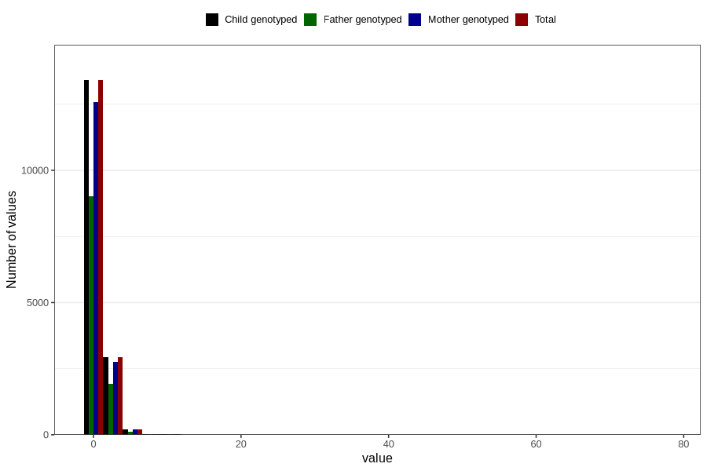

# gastric_flu_diarrhea_number_6_11m
Variable mapping to `EE241` in `Skjema5_18mnd_v12`.
- Number of values:

| Value | Total | Child genotyped | Mother genotyped | Father genotyped |
| ----- | ----- | --------------- | ---------------- | ---------------- |
| Missing | 64157 | 64157 | 60424 | 42060 |
| Non-missing | 16649 | 16649 | 15600 | 11103 |
| 25th percentile | 1 | 1 | 1 | 1 |
| 50th percentile | 1 | 1 | 1 | 1 |
| 75th percentile | 1 | 1 | 1 | 1 |
| Mean | 1.28830560394018 | 1.28830560394018 | 1.28455128205128 | 1.26722507430424 |
| Standard deviation | 1.20631579928713 | 1.20631579928713 | 1.19976804121183 | 1.17256142980229 |
| N | 16649 | 16649 | 15600 | 11103 |

