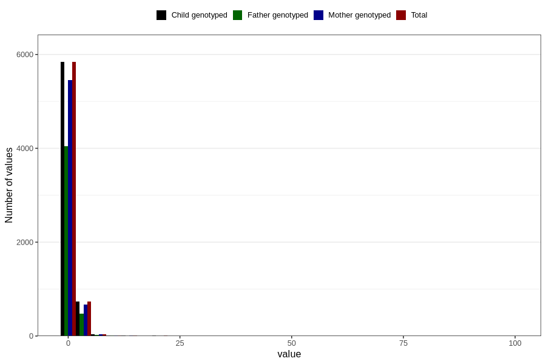

# gastric_flu_diarrhoea_freq_6m
Variable mapping to `DD284` in `Skjema4_6mnd_v12`.
- Number of values:

| Value | Total | Child genotyped | Mother genotyped | Father genotyped |
| ----- | ----- | --------------- | ---------------- | ---------------- |
| Missing | 74164 | 74164 | 69832 | 48606 |
| Non-missing | 6642 | 6642 | 6192 | 4557 |
| 25th percentile | 1 | 1 | 1 | 1 |
| 50th percentile | 1 | 1 | 1 | 1 |
| 75th percentile | 1 | 1 | 1 | 1 |
| Mean | 1.24345076784101 | 1.24345076784101 | 1.23934108527132 | 1.23041474654378 |
| Standard deviation | 1.78574303787523 | 1.78574303787523 | 1.81983261496971 | 1.96043304980944 |
| N | 6642 | 6642 | 6192 | 4557 |

