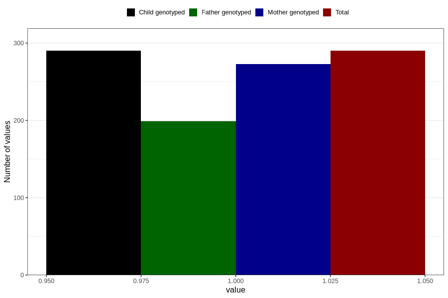

# heart_defect_previous_3y
Variable mapping to `GG63` in `Skjema6_3aar_v12`.
- Number of values:

| Value | Total | Child genotyped | Mother genotyped | Father genotyped |
| ----- | ----- | --------------- | ---------------- | ---------------- |
| Missing | 80516 | 80516 | 75751 | 52964 |
| Non-missing | 290 | 290 | 273 | 199 |
| 1 | 290 | 290 | 273 | 199 |

