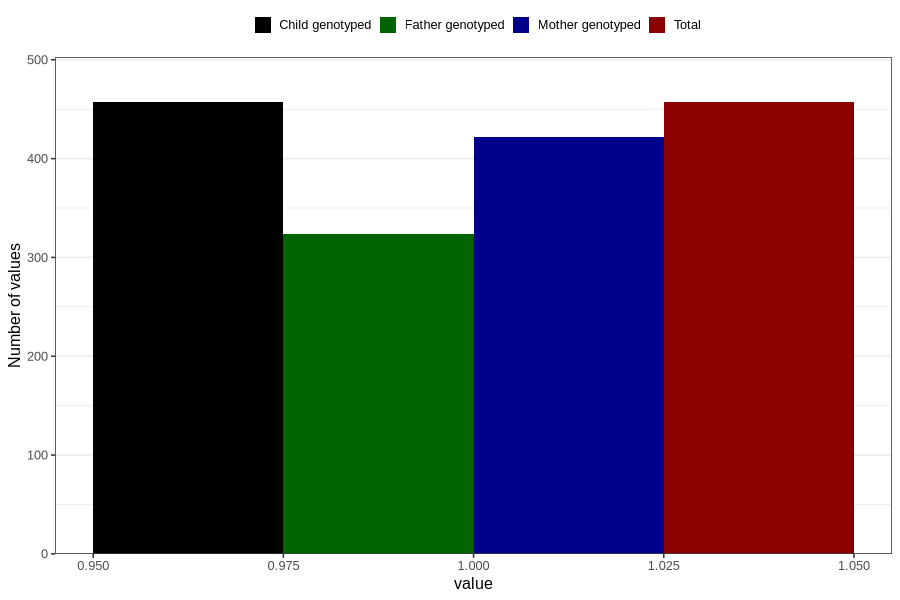

# heart_defect_yes_18m
Variable mapping to `EE816` in `Skjema5_18mnd_v12`.
- Number of values:

| Value | Total | Child genotyped | Mother genotyped | Father genotyped |
| ----- | ----- | --------------- | ---------------- | ---------------- |
| Missing | 80349 | 80349 | 75602 | 52839 |
| Non-missing | 457 | 457 | 422 | 324 |
| 1 | 457 | 457 | 422 | 324 |

