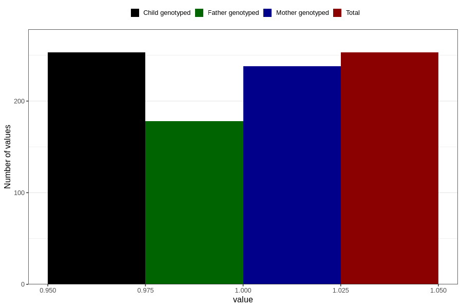

# heart_defect_yes_3y
Variable mapping to `GG62` in `Skjema6_3aar_v12`.
- Number of values:

| Value | Total | Child genotyped | Mother genotyped | Father genotyped |
| ----- | ----- | --------------- | ---------------- | ---------------- |
| Missing | 80553 | 80553 | 75786 | 52985 |
| Non-missing | 253 | 253 | 238 | 178 |
| 1 | 253 | 253 | 238 | 178 |

