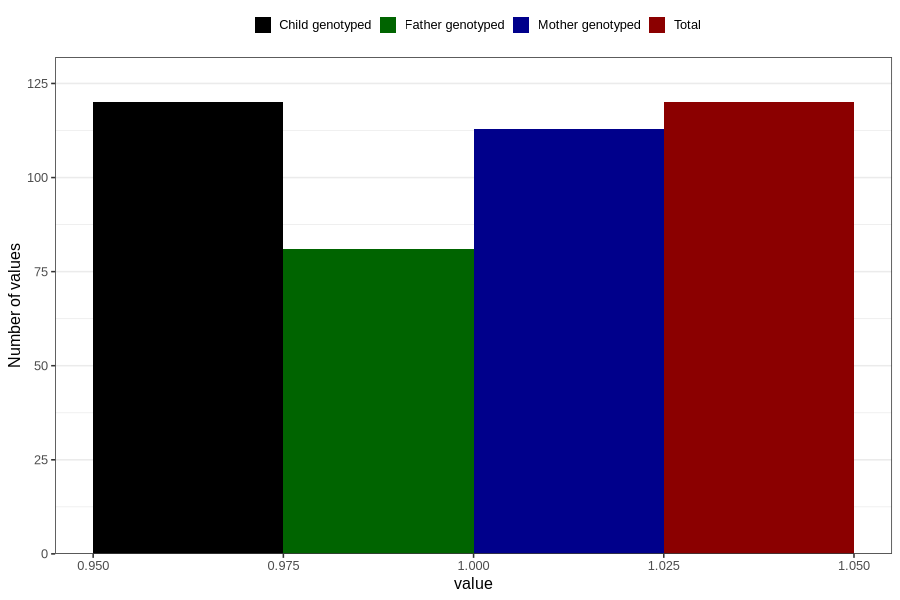

# hip_disorder_dislocated_hip_yes_18m
Variable mapping to `EE788` in `Skjema5_18mnd_v12`.
- Number of values:

| Value | Total | Child genotyped | Mother genotyped | Father genotyped |
| ----- | ----- | --------------- | ---------------- | ---------------- |
| Missing | 80686 | 80686 | 75911 | 53082 |
| Non-missing | 120 | 120 | 113 | 81 |
| 1 | 120 | 120 | 113 | 81 |

