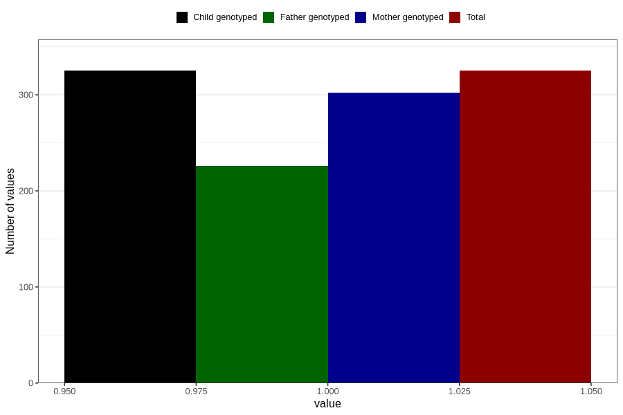

# hives_yes_18m
Variable mapping to `EE832` in `Skjema5_18mnd_v12`.
- Number of values:

| Value | Total | Child genotyped | Mother genotyped | Father genotyped |
| ----- | ----- | --------------- | ---------------- | ---------------- |
| Missing | 80481 | 80481 | 75722 | 52937 |
| Non-missing | 325 | 325 | 302 | 226 |
| 1 | 325 | 325 | 302 | 226 |

