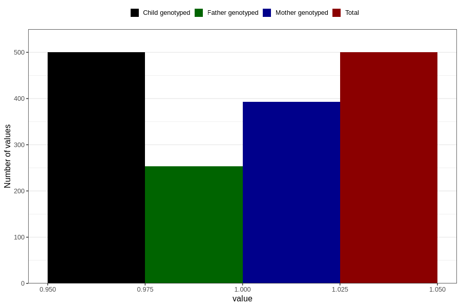

# hyperactivity_currently_8y
Variable mapping to `NN45` in `Skjema8aar_v12`.
- Number of values:

| Value | Total | Child genotyped | Mother genotyped | Father genotyped |
| ----- | ----- | --------------- | ---------------- | ---------------- |
| Missing | 80306 | 80306 | 75631 | 52910 |
| Non-missing | 500 | 500 | 393 | 253 |
| 1 | 500 | 500 | 393 | 253 |

