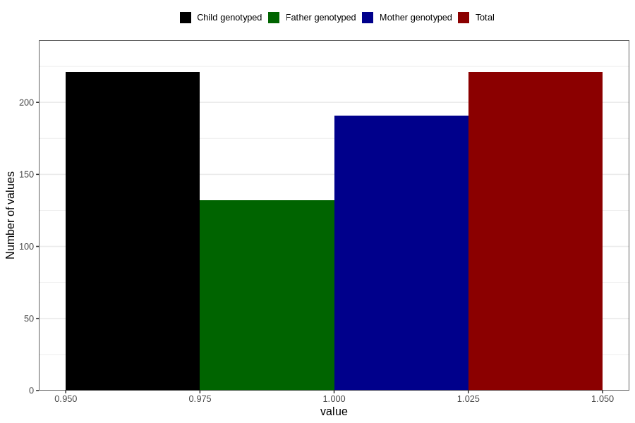

# hyperactivity_past_8y
Variable mapping to `NN46` in `Skjema8aar_v12`.
- Number of values:

| Value | Total | Child genotyped | Mother genotyped | Father genotyped |
| ----- | ----- | --------------- | ---------------- | ---------------- |
| Missing | 80585 | 80585 | 75833 | 53031 |
| Non-missing | 221 | 221 | 191 | 132 |
| 1 | 221 | 221 | 191 | 132 |

