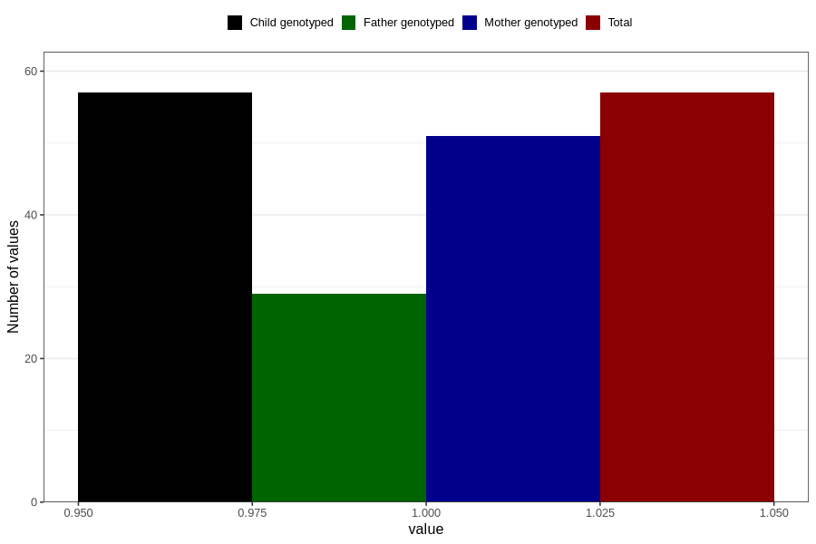

# hyperactivity_previous_3y
Variable mapping to `GG107` in `Skjema6_3aar_v12`.
- Number of values:

| Value | Total | Child genotyped | Mother genotyped | Father genotyped |
| ----- | ----- | --------------- | ---------------- | ---------------- |
| Missing | 80749 | 80749 | 75973 | 53134 |
| Non-missing | 57 | 57 | 51 | 29 |
| 1 | 57 | 57 | 51 | 29 |

