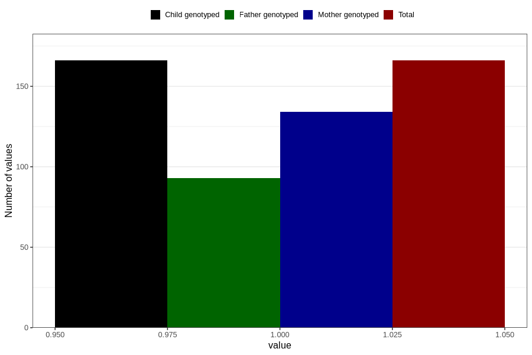

# hyperactivity_yes_3y
Variable mapping to `GG106` in `Skjema6_3aar_v12`.
- Number of values:

| Value | Total | Child genotyped | Mother genotyped | Father genotyped |
| ----- | ----- | --------------- | ---------------- | ---------------- |
| Missing | 80640 | 80640 | 75890 | 53070 |
| Non-missing | 166 | 166 | 134 | 93 |
| 1 | 166 | 166 | 134 | 93 |

