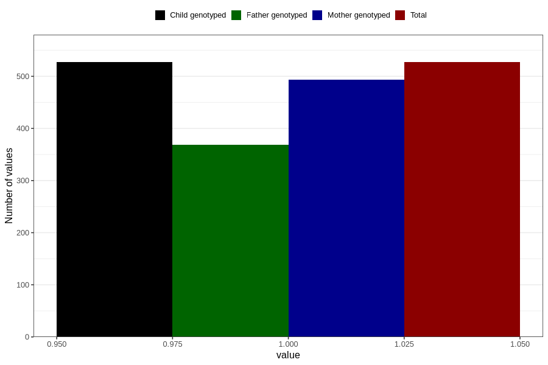

# impaired_hearing_previously_18m
Variable mapping to `EE793` in `Skjema5_18mnd_v12`.
- Number of values:

| Value | Total | Child genotyped | Mother genotyped | Father genotyped |
| ----- | ----- | --------------- | ---------------- | ---------------- |
| Missing | 80279 | 80279 | 75530 | 52794 |
| Non-missing | 527 | 527 | 494 | 369 |
| 1 | 527 | 527 | 494 | 369 |

