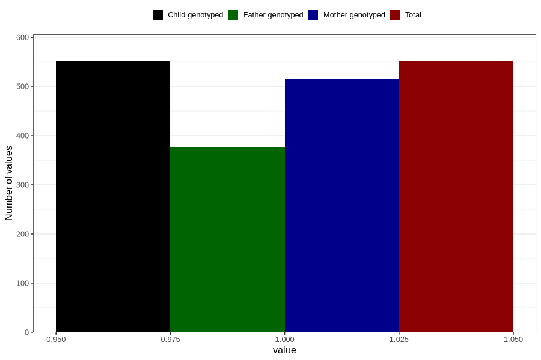

# impaired_hearing_yes_3y
Variable mapping to `GG30` in `Skjema6_3aar_v12`.
- Number of values:

| Value | Total | Child genotyped | Mother genotyped | Father genotyped |
| ----- | ----- | --------------- | ---------------- | ---------------- |
| Missing | 80255 | 80255 | 75508 | 52786 |
| Non-missing | 551 | 551 | 516 | 377 |
| 1 | 551 | 551 | 516 | 377 |

