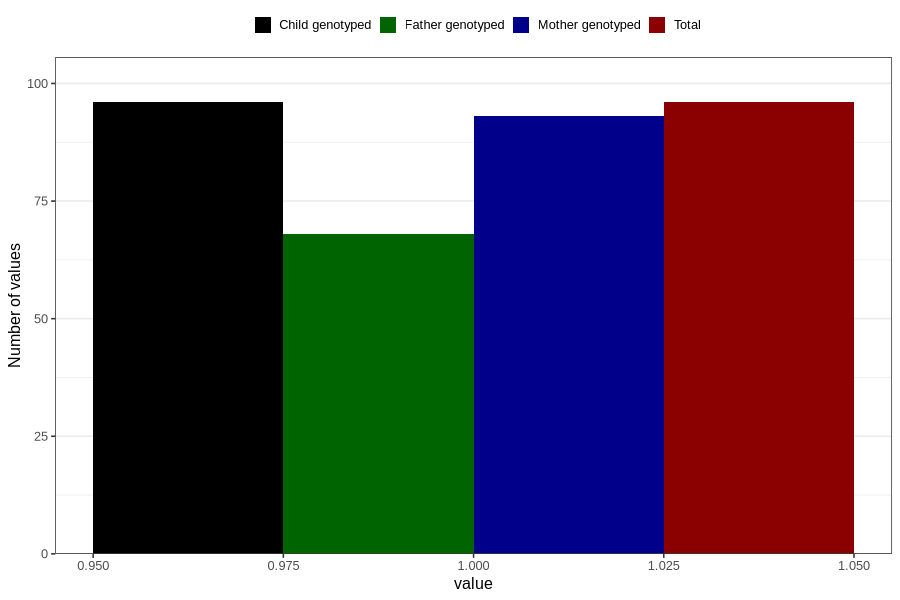

# impaired_vision_previous_3y
Variable mapping to `GG35` in `Skjema6_3aar_v12`.
- Number of values:

| Value | Total | Child genotyped | Mother genotyped | Father genotyped |
| ----- | ----- | --------------- | ---------------- | ---------------- |
| Missing | 80710 | 80710 | 75931 | 53095 |
| Non-missing | 96 | 96 | 93 | 68 |
| 1 | 96 | 96 | 93 | 68 |

