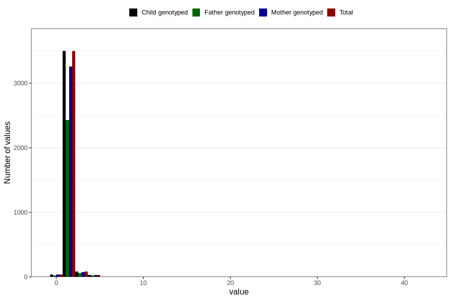

# injury_or_accident_freq_3y
Variable mapping to `GG165` in `Skjema6_3aar_v12`.
- Number of values:

| Value | Total | Child genotyped | Mother genotyped | Father genotyped |
| ----- | ----- | --------------- | ---------------- | ---------------- |
| Missing | 77150 | 77150 | 72617 | 50626 |
| Non-missing | 3656 | 3656 | 3407 | 2537 |
| 0 | 37 | 37 | 35 | 25 |
| 1 | 2965 | 2965 | 2763 | 2060 |
| 2 | 531 | 531 | 496 | 371 |
| 3 | 88 | 88 | 79 | 61 |
| 4 | 18 | 18 | 18 | 13 |
| 5 | 12 | 12 | 11 | 7 |
| 7 | 1 | 1 | 1 | 0 |
| 8 | 1 | 1 | 1 | 0 |
| 10 | 1 | 1 | 1 | 0 |
| 35 | 1 | 1 | 1 | 0 |
| 42 | 1 | 1 | 1 | 0 |

