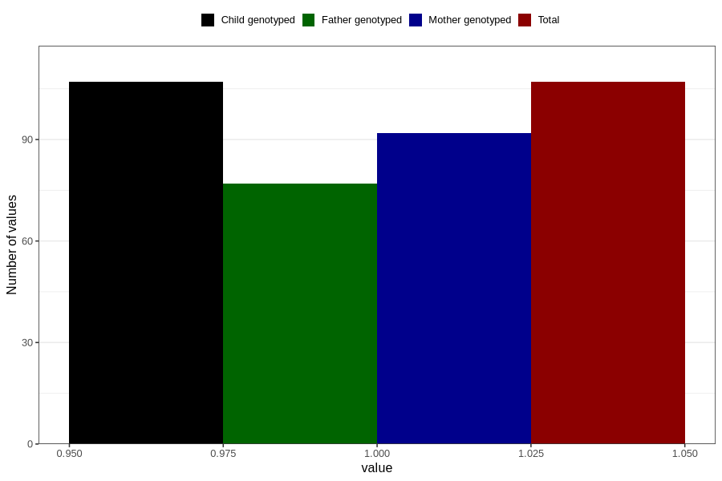

# joint_problems_previous_3y
Variable mapping to `GG47` in `Skjema6_3aar_v12`.
- Number of values:

| Value | Total | Child genotyped | Mother genotyped | Father genotyped |
| ----- | ----- | --------------- | ---------------- | ---------------- |
| Missing | 80699 | 80699 | 75932 | 53086 |
| Non-missing | 107 | 107 | 92 | 77 |
| 1 | 107 | 107 | 92 | 77 |

