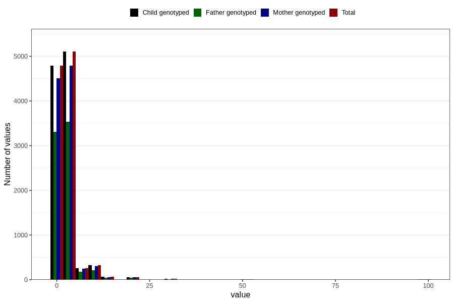

# nappy_rash_freq_6m
Variable mapping to `DD308` in `Skjema4_6mnd_v12`.
- Number of values:

| Value | Total | Child genotyped | Mother genotyped | Father genotyped |
| ----- | ----- | --------------- | ---------------- | ---------------- |
| Missing | 70165 | 70165 | 66015 | 45811 |
| Non-missing | 10641 | 10641 | 10009 | 7352 |
| 25th percentile | 1 | 1 | 1 | 1 |
| 50th percentile | 2 | 2 | 2 | 2 |
| 75th percentile | 3 | 3 | 3 | 3 |
| Mean | 2.69937035992858 | 2.69937035992858 | 2.70956139474473 | 2.66254080522307 |
| Standard deviation | 4.55836508769197 | 4.55836508769197 | 4.5635522009176 | 4.26821102119143 |
| N | 10641 | 10641 | 10009 | 7352 |

