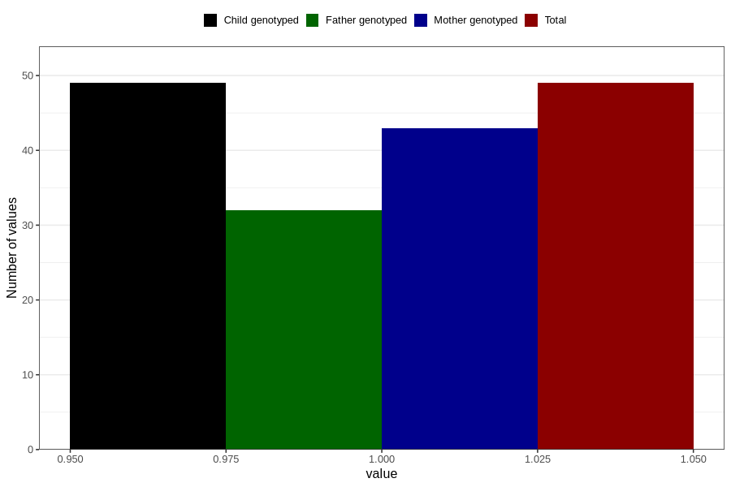

# other_behavioral_problems_previous_3y
Variable mapping to `GG111` in `Skjema6_3aar_v12`.
- Number of values:

| Value | Total | Child genotyped | Mother genotyped | Father genotyped |
| ----- | ----- | --------------- | ---------------- | ---------------- |
| Missing | 80757 | 80757 | 75981 | 53131 |
| Non-missing | 49 | 49 | 43 | 32 |
| 1 | 49 | 49 | 43 | 32 |

