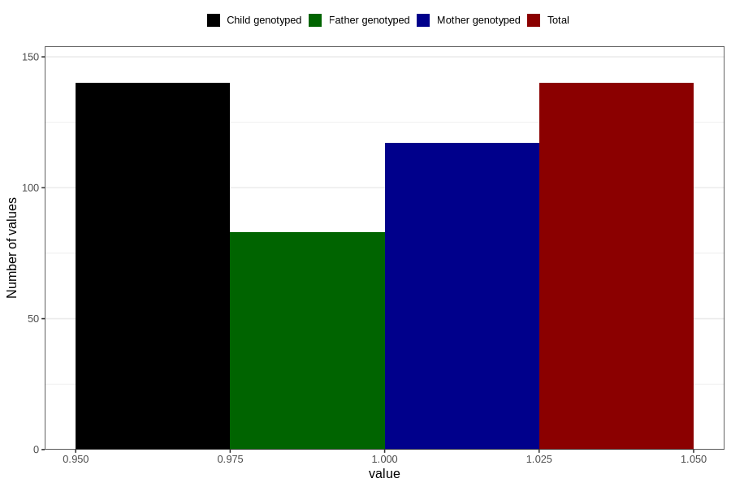

# other_behavioral_problems_yes_3y
Variable mapping to `GG110` in `Skjema6_3aar_v12`.
- Number of values:

| Value | Total | Child genotyped | Mother genotyped | Father genotyped |
| ----- | ----- | --------------- | ---------------- | ---------------- |
| Missing | 80666 | 80666 | 75907 | 53080 |
| Non-missing | 140 | 140 | 117 | 83 |
| 1 | 140 | 140 | 117 | 83 |

