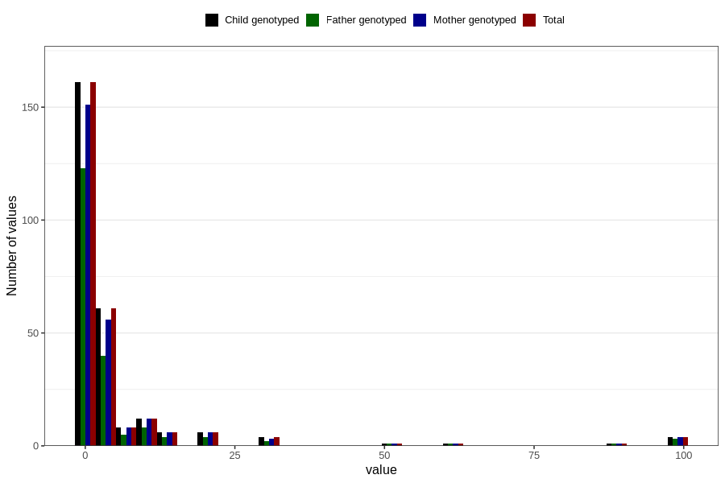

# other_convulsions_with_any_fever_freq_6m
Variable mapping to `DD300` in `Skjema4_6mnd_v12`.
- Number of values:

| Value | Total | Child genotyped | Mother genotyped | Father genotyped |
| ----- | ----- | --------------- | ---------------- | ---------------- |
| Missing | 80541 | 80541 | 75775 | 52971 |
| Non-missing | 265 | 265 | 249 | 192 |
| 25th percentile | 0 | 0 | 0 | 0 |
| 50th percentile | 1 | 1 | 1 | 1 |
| 75th percentile | 3 | 3 | 3 | 3 |
| Mean | 5.08679245283019 | 5.08679245283019 | 5.22088353413655 | 5.13541666666667 |
| Standard deviation | 14.5629516152608 | 14.5629516152608 | 14.9087075938676 | 15.2250962508098 |
| N | 265 | 265 | 249 | 192 |

