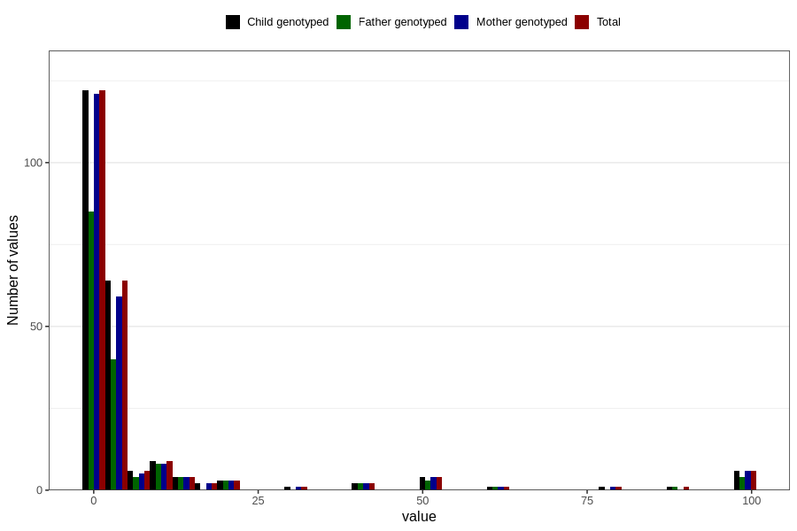

# other_convulsions_without_any_fever_freq_3y
Variable mapping to `GG162` in `Skjema6_3aar_v12`.
- Number of values:

| Value | Total | Child genotyped | Mother genotyped | Father genotyped |
| ----- | ----- | --------------- | ---------------- | ---------------- |
| Missing | 80580 | 80580 | 75807 | 53008 |
| Non-missing | 226 | 226 | 217 | 155 |
| 25th percentile | 1 | 1 | 1 | 1 |
| 50th percentile | 1 | 1 | 1 | 1 |
| 75th percentile | 4 | 4 | 4 | 4 |
| Mean | 7.47787610619469 | 7.47787610619469 | 7.24884792626728 | 7.63225806451613 |
| Standard deviation | 19.1935625065085 | 19.1935625065085 | 18.7397579695997 | 19.0825341216621 |
| N | 226 | 226 | 217 | 155 |

