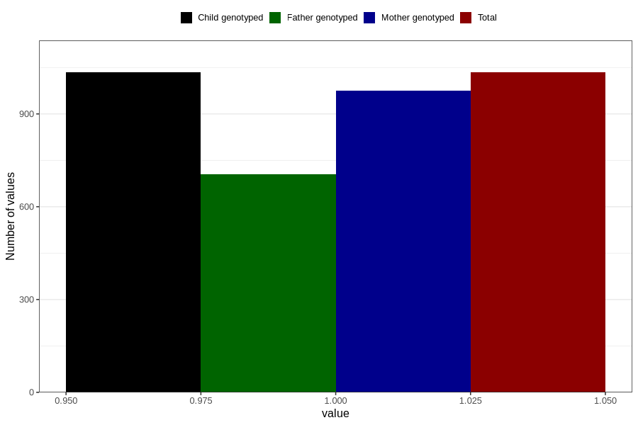

# other_eczema_previous_3y
Variable mapping to `GG83` in `Skjema6_3aar_v12`.
- Number of values:

| Value | Total | Child genotyped | Mother genotyped | Father genotyped |
| ----- | ----- | --------------- | ---------------- | ---------------- |
| Missing | 79772 | 79772 | 75050 | 52458 |
| Non-missing | 1034 | 1034 | 974 | 705 |
| 1 | 1034 | 1034 | 974 | 705 |

