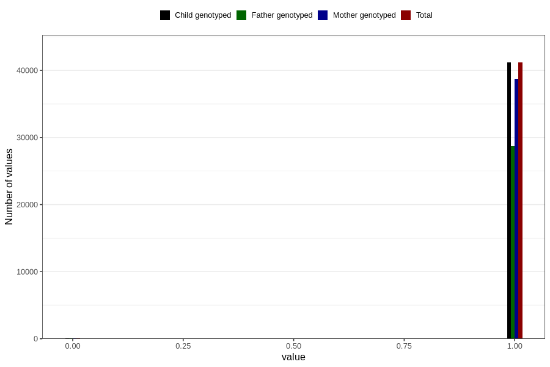

# other_gastrointestinal_problems_2_no_3y
Variable mapping to `GG574` in `Skjema6_3aar_v12`.
- Number of values:

| Value | Total | Child genotyped | Mother genotyped | Father genotyped |
| ----- | ----- | --------------- | ---------------- | ---------------- |
| Missing | 39565 | 39565 | 37237 | 24406 |
| Non-missing | 41241 | 41241 | 38787 | 28757 |
| 0 | 76 | 76 | 72 | 50 |
| 1 | 41165 | 41165 | 38715 | 28707 |

