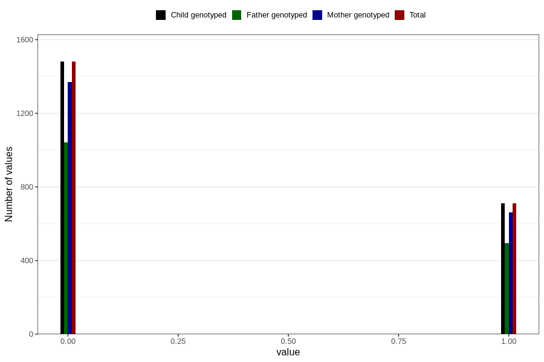

# other_gastrointestinal_problems_2_previous_3y
Variable mapping to `GG576` in `Skjema6_3aar_v12`.
- Number of values:

| Value | Total | Child genotyped | Mother genotyped | Father genotyped |
| ----- | ----- | --------------- | ---------------- | ---------------- |
| Missing | 78615 | 78615 | 73993 | 51627 |
| Non-missing | 2191 | 2191 | 2031 | 1536 |
| 0 | 1480 | 1480 | 1371 | 1042 |
| 1 | 711 | 711 | 660 | 494 |

