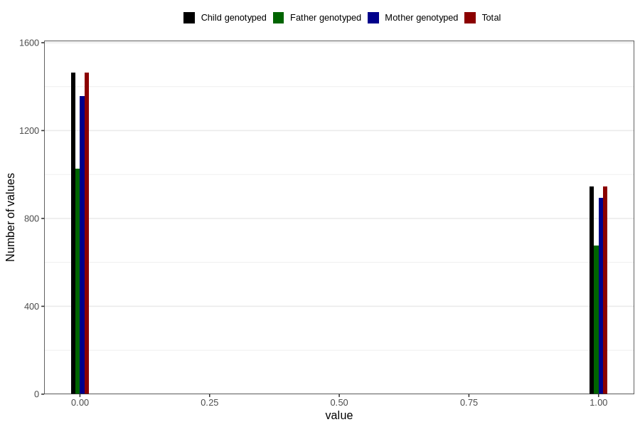

# other_gastrointestinal_problems_2_yes_3y
Variable mapping to `GG575` in `Skjema6_3aar_v12`.
- Number of values:

| Value | Total | Child genotyped | Mother genotyped | Father genotyped |
| ----- | ----- | --------------- | ---------------- | ---------------- |
| Missing | 78397 | 78397 | 73775 | 51459 |
| Non-missing | 2409 | 2409 | 2249 | 1704 |
| 0 | 1463 | 1463 | 1356 | 1027 |
| 1 | 946 | 946 | 893 | 677 |

