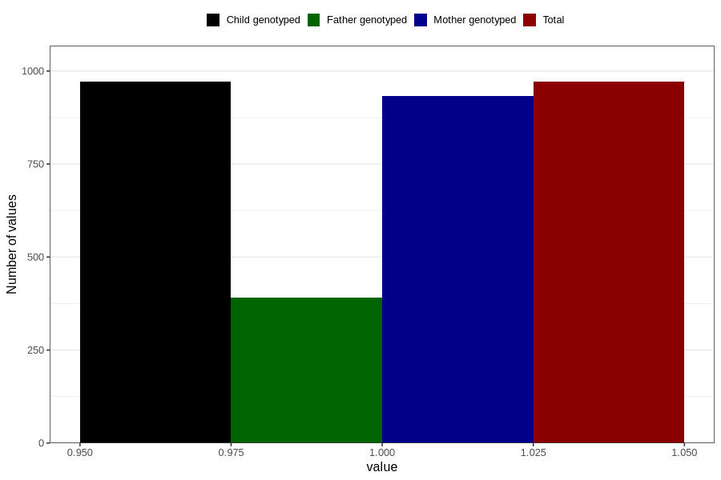

# other_gastrointestinal_problems_no_3y
Variable mapping to `GG89` in `Skjema6_3aar_v12`.
- Number of values:

| Value | Total | Child genotyped | Mother genotyped | Father genotyped |
| ----- | ----- | --------------- | ---------------- | ---------------- |
| Missing | 79835 | 79835 | 75091 | 52771 |
| Non-missing | 971 | 971 | 933 | 392 |
| 1 | 971 | 971 | 933 | 392 |

