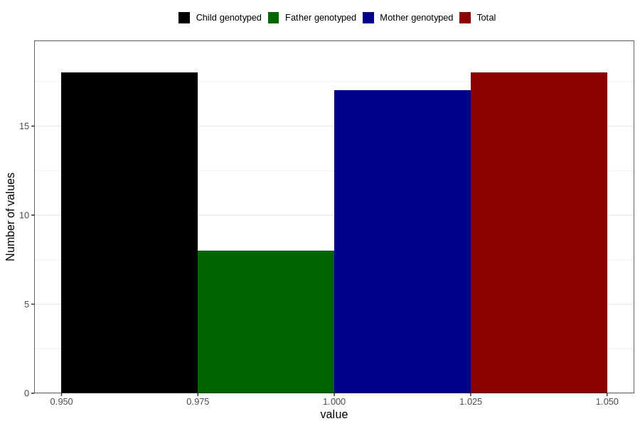

# other_gastrointestinal_problems_previous_3y
Variable mapping to `GG91` in `Skjema6_3aar_v12`.
- Number of values:

| Value | Total | Child genotyped | Mother genotyped | Father genotyped |
| ----- | ----- | --------------- | ---------------- | ---------------- |
| Missing | 80788 | 80788 | 76007 | 53155 |
| Non-missing | 18 | 18 | 17 | 8 |
| 1 | 18 | 18 | 17 | 8 |

