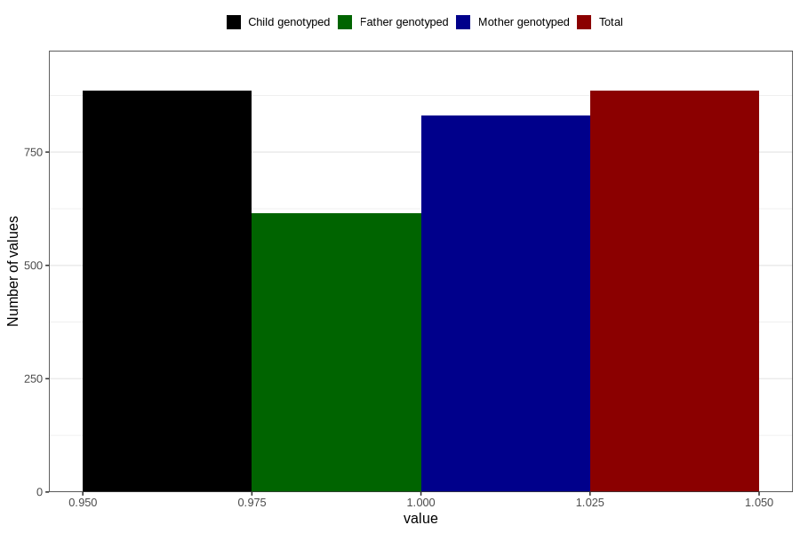

# other_longterm_illness_condition_previous_3y
Variable mapping to `GG115` in `Skjema6_3aar_v12`.
- Number of values:

| Value | Total | Child genotyped | Mother genotyped | Father genotyped |
| ----- | ----- | --------------- | ---------------- | ---------------- |
| Missing | 79921 | 79921 | 75193 | 52547 |
| Non-missing | 885 | 885 | 831 | 616 |
| 1 | 885 | 885 | 831 | 616 |

