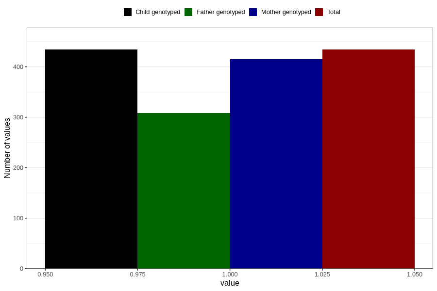

# other_malformations_previously_18m
Variable mapping to `EE853` in `Skjema5_18mnd_v12`.
- Number of values:

| Value | Total | Child genotyped | Mother genotyped | Father genotyped |
| ----- | ----- | --------------- | ---------------- | ---------------- |
| Missing | 80372 | 80372 | 75609 | 52855 |
| Non-missing | 434 | 434 | 415 | 308 |
| 1 | 434 | 434 | 415 | 308 |

