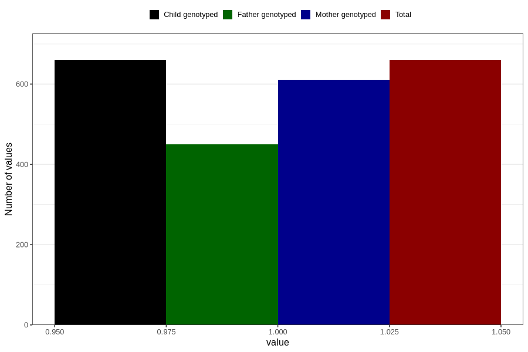

# other_malformations_yes_18m
Variable mapping to `EE852` in `Skjema5_18mnd_v12`.
- Number of values:

| Value | Total | Child genotyped | Mother genotyped | Father genotyped |
| ----- | ----- | --------------- | ---------------- | ---------------- |
| Missing | 80146 | 80146 | 75414 | 52713 |
| Non-missing | 660 | 660 | 610 | 450 |
| 1 | 660 | 660 | 610 | 450 |

