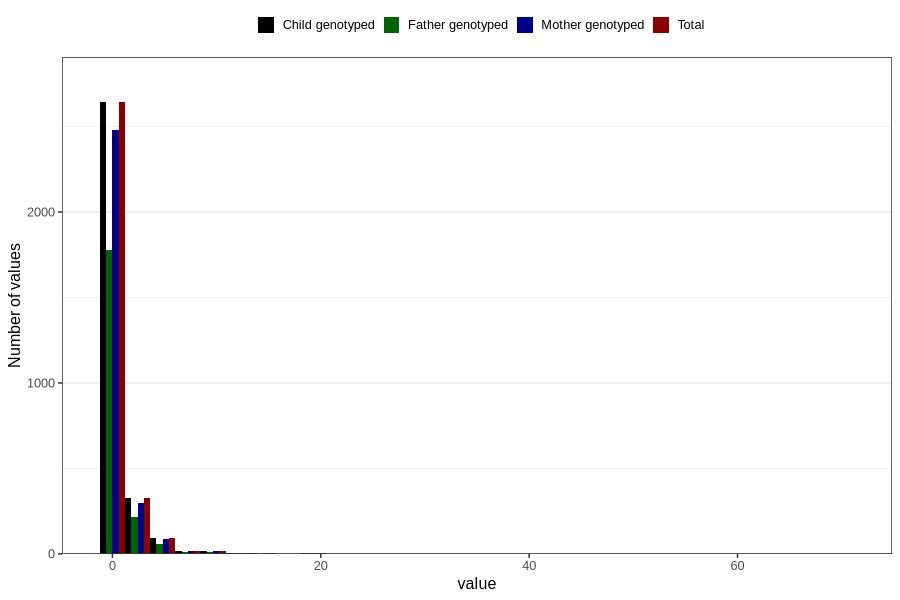

# other_number_12_18m
Variable mapping to `EE273` in `Skjema5_18mnd_v12`.
- Number of values:

| Value | Total | Child genotyped | Mother genotyped | Father genotyped |
| ----- | ----- | --------------- | ---------------- | ---------------- |
| Missing | 77691 | 77691 | 73102 | 51073 |
| Non-missing | 3115 | 3115 | 2922 | 2090 |
| Filled in text or mark instead of number | 4 | 4 | 4 |4 |
| 25th percentile | 1 | 1 | 1 | 1 |
| 50th percentile | 1 | 1 | 1 | 1 |
| 75th percentile | 1 | 1 | 1 | 1 |
| Mean | 1.41305046608807 | 1.41305046608807 | 1.41638108293352 | 1.39453499520614 |
| Standard deviation | 2.3301622254965 | 2.3301622254965 | 2.37264557598061 | 2.13054723258733 |
| N | 3111 | 3111 | 2918 | 2086 |

