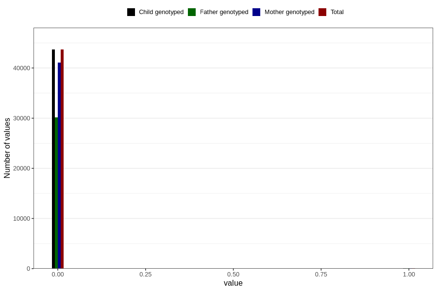

# overweight_3y
Variable created during phenotype curation.
- Number of values:

| Value | Total | Child genotyped | Mother genotyped | Father genotyped |
| ----- | ----- | --------------- | ---------------- | ---------------- |
| Missing | 37018 | 37018 | 34827 | 22898 |
| Non-missing | 43788 | 43788 | 41197 | 30265 |
| 0 | 43671 | 43671 | 41087 | 30180 |
| 1 | 117 | 117 | 110 | 85 |

