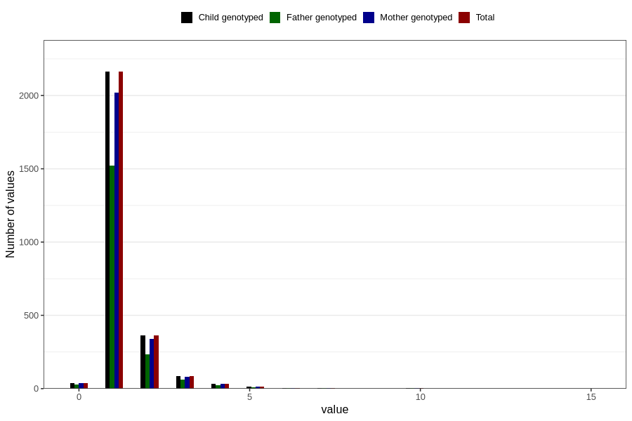

# pneumonia_freq_3y
Variable mapping to `GG147` in `Skjema6_3aar_v12`.
- Number of values:

| Value | Total | Child genotyped | Mother genotyped | Father genotyped |
| ----- | ----- | --------------- | ---------------- | ---------------- |
| Missing | 78094 | 78094 | 73486 | 51280 |
| Non-missing | 2712 | 2712 | 2538 | 1883 |
| 0 | 38 | 38 | 37 | 27 |
| 1 | 2162 | 2162 | 2020 | 1521 |
| 2 | 362 | 362 | 341 | 233 |
| 3 | 86 | 86 | 80 | 61 |
| 4 | 34 | 34 | 32 | 21 |
| 5 | 14 | 14 | 12 | 8 |
| 6 | 5 | 5 | 5 | 4 |
| 7 | 4 | 4 | 4 | 3 |
| 9 | 1 | 1 | 1 | 0 |
| 10 | 3 | 3 | 3 | 3 |
| 11 | 1 | 1 | 1 | 1 |
| 12 | 1 | 1 | 1 | 0 |
| 15 | 1 | 1 | 1 | 1 |

