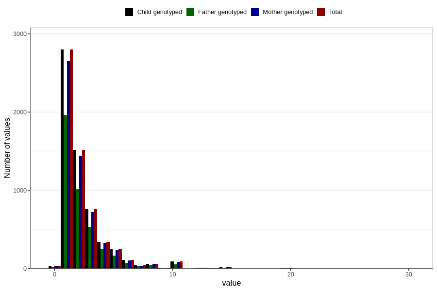

# pseudo_croup_freq_3y
Variable mapping to `GG141` in `Skjema6_3aar_v12`.
- Number of values:

| Value | Total | Child genotyped | Mother genotyped | Father genotyped |
| ----- | ----- | --------------- | ---------------- | ---------------- |
| Missing | 74734 | 74734 | 70269 | 48967 |
| Non-missing | 6072 | 6072 | 5755 | 4196 |
| 25th percentile | 1 | 1 | 1 | 1 |
| 50th percentile | 2 | 2 | 2 | 2 |
| 75th percentile | 3 | 3 | 3 | 3 |
| Mean | 2.29183135704875 | 2.29183135704875 | 2.27697654213727 | 2.28765490943756 |
| Standard deviation | 2.11070932670821 | 2.11070932670821 | 2.07080519752977 | 2.1647187522528 |
| N | 6072 | 6072 | 5755 | 4196 |

