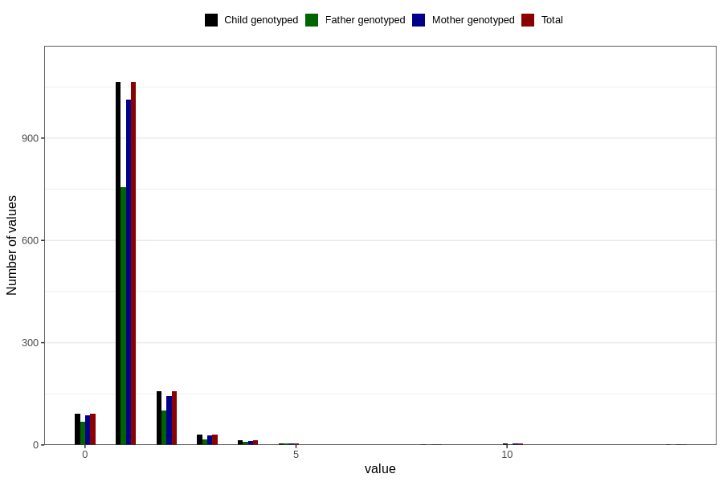

# pseudocroup_freq_6m
Variable mapping to `DD276` in `Skjema4_6mnd_v12`.
- Number of values:

| Value | Total | Child genotyped | Mother genotyped | Father genotyped |
| ----- | ----- | --------------- | ---------------- | ---------------- |
| Missing | 79439 | 79439 | 74731 | 52207 |
| Non-missing | 1367 | 1367 | 1293 | 956 |
| 0 | 92 | 92 | 87 | 67 |
| 1 | 1064 | 1064 | 1014 | 755 |
| 2 | 157 | 157 | 143 | 101 |
| 3 | 30 | 30 | 27 | 17 |
| 4 | 13 | 13 | 12 | 10 |
| 5 | 5 | 5 | 4 | 4 |
| 8 | 1 | 1 | 1 | 0 |
| 10 | 4 | 4 | 4 | 2 |
| 14 | 1 | 1 | 1 | 0 |

