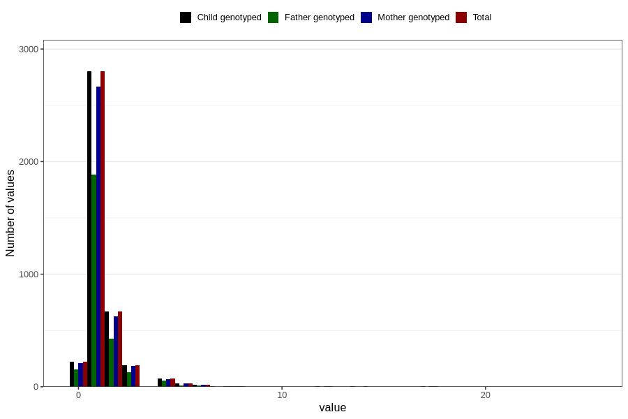

# pseudocroup_number_12_18m
Variable mapping to `EE233` in `Skjema5_18mnd_v12`.
- Number of values:

| Value | Total | Child genotyped | Mother genotyped | Father genotyped |
| ----- | ----- | --------------- | ---------------- | ---------------- |
| Missing | 76776 | 76776 | 72205 | 50465 |
| Non-missing | 4030 | 4030 | 3819 | 2698 |
| 0 | 225 | 225 | 207 | 155 |
| 1 | 2801 | 2801 | 2665 | 1884 |
| 2 | 666 | 666 | 627 | 429 |
| 3 | 192 | 192 | 185 | 131 |
| 4 | 73 | 73 | 68 | 54 |
| 5 | 29 | 29 | 28 | 14 |
| 6 | 17 | 17 | 17 | 13 |
| 7 | 3 | 3 | 1 | 0 |
| 8 | 5 | 5 | 4 | 5 |
| 10 | 2 | 2 | 2 | 2 |
| 11 | 1 | 1 | 1 | 1 |
| 12 | 4 | 4 | 3 | 2 |
| 13 | 1 | 1 | 1 | 0 |
| 14 | 3 | 3 | 2 | 2 |
| 15 | 1 | 1 | 1 | 1 |
| 16 | 1 | 1 | 1 | 1 |
| 17 | 3 | 3 | 3 | 2 |
| 18 | 2 | 2 | 2 | 2 |
| 25 | 1 | 1 | 1 | 0 |

