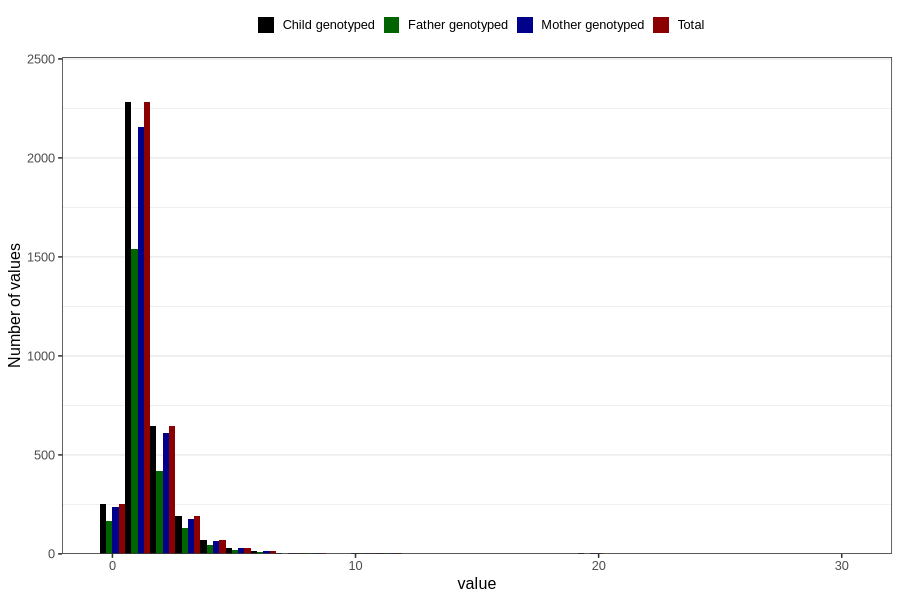

# pseudocroup_number_6_11m
Variable mapping to `EE231` in `Skjema5_18mnd_v12`.
- Number of values:

| Value | Total | Child genotyped | Mother genotyped | Father genotyped |
| ----- | ----- | --------------- | ---------------- | ---------------- |
| Missing | 77296 | 77296 | 72711 | 50815 |
| Non-missing | 3510 | 3510 | 3313 | 2348 |
| 0 | 251 | 251 | 235 | 167 |
| 1 | 2281 | 2281 | 2158 | 1542 |
| 2 | 647 | 647 | 611 | 420 |
| 3 | 191 | 191 | 178 | 129 |
| 4 | 71 | 71 | 67 | 46 |
| 5 | 31 | 31 | 30 | 21 |
| 6 | 17 | 17 | 15 | 10 |
| 7 | 3 | 3 | 3 | 1 |
| 8 | 5 | 5 | 4 | 4 |
| 9 | 1 | 1 | 1 | 1 |
| 10 | 6 | 6 | 5 | 4 |
| 11 | 3 | 3 | 3 | 2 |
| 20 | 2 | 2 | 2 | 1 |
| 30 | 1 | 1 | 1 | 0 |

