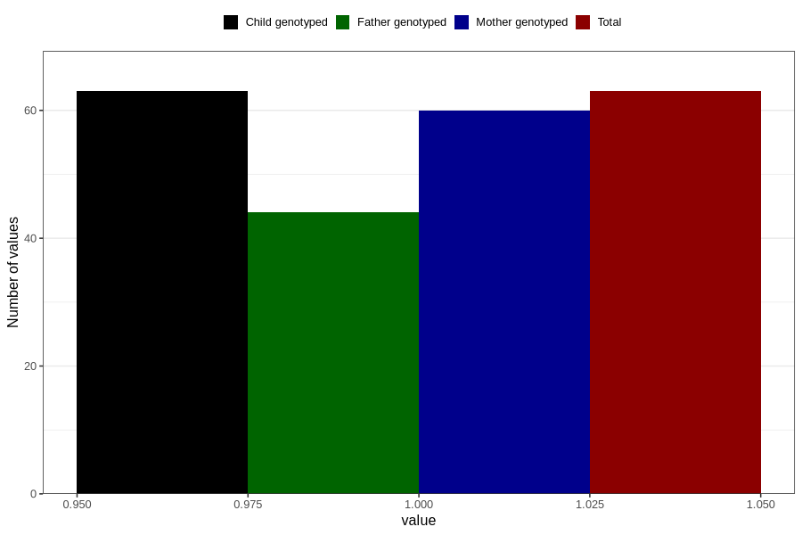

# rheumatoid_arthritis_7y
Variable mapping to `JJ427` in `Skjema7aar_v12`.
Variable mapping to `JJ427` in `Skjema7aar_v12`.
Variable mapping to `JJ427` in `Skjema7aar_v12`.
- Number of values:

| Value | Total | Child genotyped | Mother genotyped | Father genotyped |
| ----- | ----- | --------------- | ---------------- | ---------------- |
| Missing | 80743 | 80743 | 75964 | 53119 |
| Non-missing | 63 | 63 | 60 | 44 |
| 1 | 63 | 63 | 60 | 44 |

