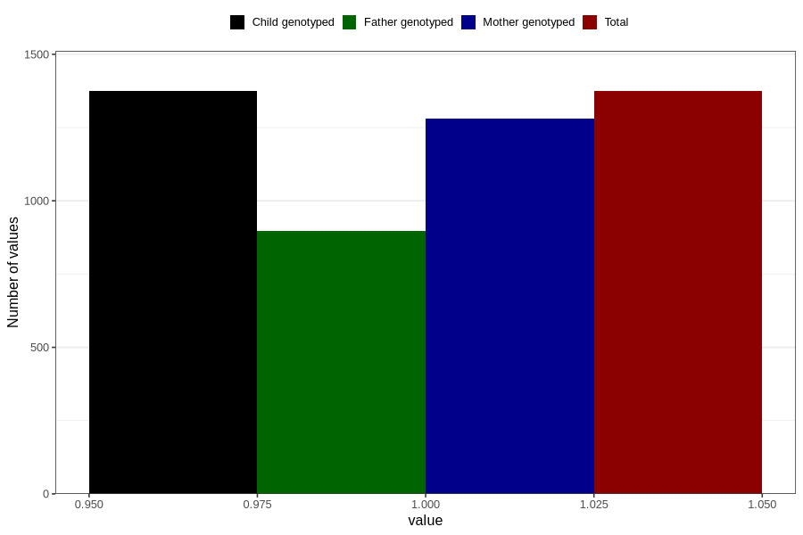

# sleep_problems_previous_3y
Variable mapping to `GG99` in `Skjema6_3aar_v12`.
- Number of values:

| Value | Total | Child genotyped | Mother genotyped | Father genotyped |
| ----- | ----- | --------------- | ---------------- | ---------------- |
| Missing | 79432 | 79432 | 74743 | 52267 |
| Non-missing | 1374 | 1374 | 1281 | 896 |
| 1 | 1374 | 1374 | 1281 | 896 |

