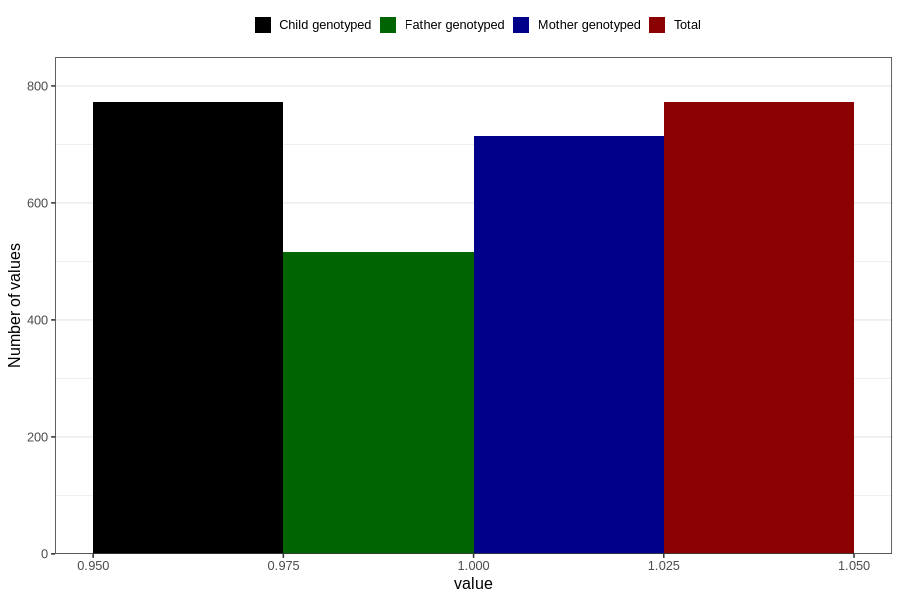

# sleep_problems_yes_3y
Variable mapping to `GG98` in `Skjema6_3aar_v12`.
- Number of values:

| Value | Total | Child genotyped | Mother genotyped | Father genotyped |
| ----- | ----- | --------------- | ---------------- | ---------------- |
| Missing | 80034 | 80034 | 75310 | 52647 |
| Non-missing | 772 | 772 | 714 | 516 |
| 1 | 772 | 772 | 714 | 516 |

