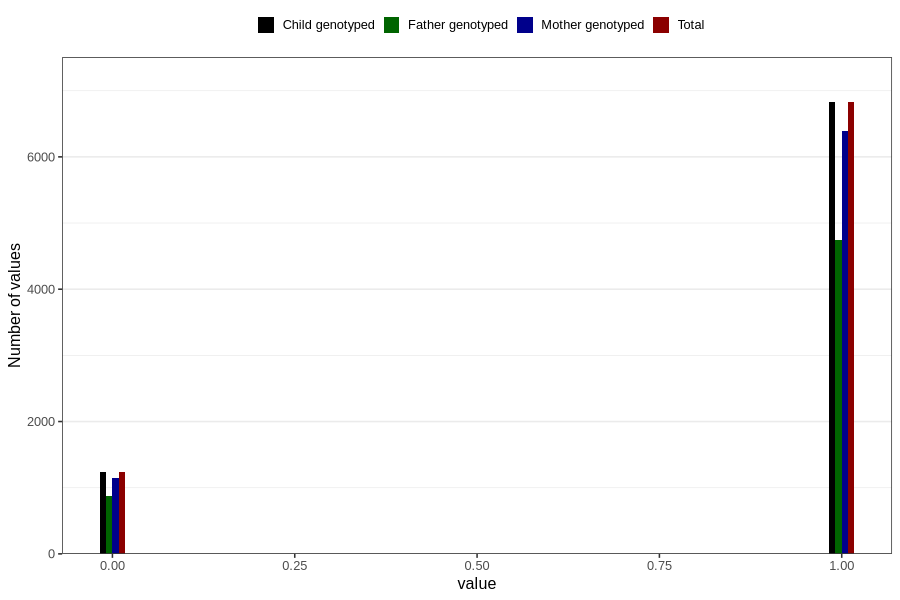

# specialist_diagnosis_1_3y
Variable mapping to `GG118` in `Skjema6_3aar_v12`.
- Number of values:

| Value | Total | Child genotyped | Mother genotyped | Father genotyped |
| ----- | ----- | --------------- | ---------------- | ---------------- |
| Missing | 72748 | 72748 | 68494 | 47548 |
| Non-missing | 8058 | 8058 | 7530 | 5615 |
| 0 | 1233 | 1233 | 1140 | 872 |
| 1 | 6825 | 6825 | 6390 | 4743 |

