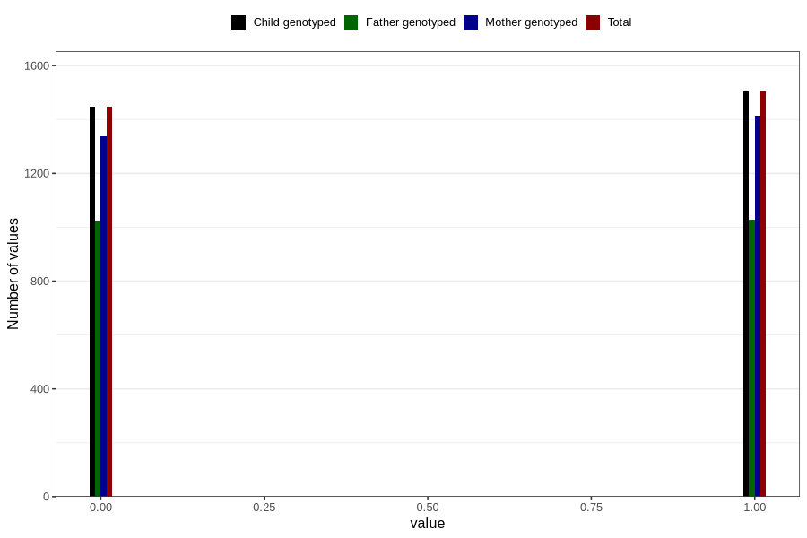

# specialist_diagnosis_2_3y
Variable mapping to `GG120` in `Skjema6_3aar_v12`.
- Number of values:

| Value | Total | Child genotyped | Mother genotyped | Father genotyped |
| ----- | ----- | --------------- | ---------------- | ---------------- |
| Missing | 77855 | 77855 | 73273 | 51114 |
| Non-missing | 2951 | 2951 | 2751 | 2049 |
| 0 | 1448 | 1448 | 1338 | 1021 |
| 1 | 1503 | 1503 | 1413 | 1028 |

