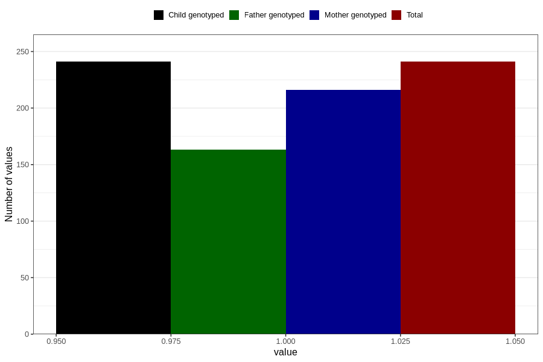

# specialist_diagnosis_3_18m
Variable mapping to `EE864` in `Skjema5_18mnd_v12`.
- Number of values:

| Value | Total | Child genotyped | Mother genotyped | Father genotyped |
| ----- | ----- | --------------- | ---------------- | ---------------- |
| Missing | 80565 | 80565 | 75808 | 53000 |
| Non-missing | 241 | 241 | 216 | 163 |
| 1 | 241 | 241 | 216 | 163 |

