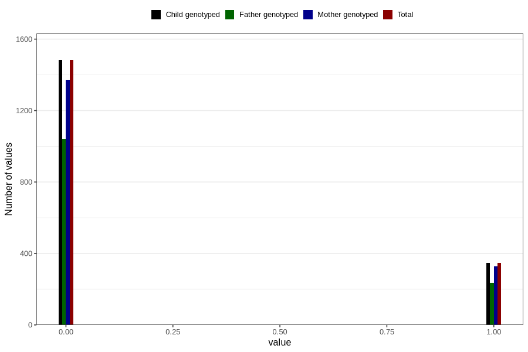

# specialist_diagnosis_3_3y
Variable mapping to `GG122` in `Skjema6_3aar_v12`.
- Number of values:

| Value | Total | Child genotyped | Mother genotyped | Father genotyped |
| ----- | ----- | --------------- | ---------------- | ---------------- |
| Missing | 78976 | 78976 | 74324 | 51884 |
| Non-missing | 1830 | 1830 | 1700 | 1279 |
| 0 | 1483 | 1483 | 1373 | 1042 |
| 1 | 347 | 347 | 327 | 237 |

