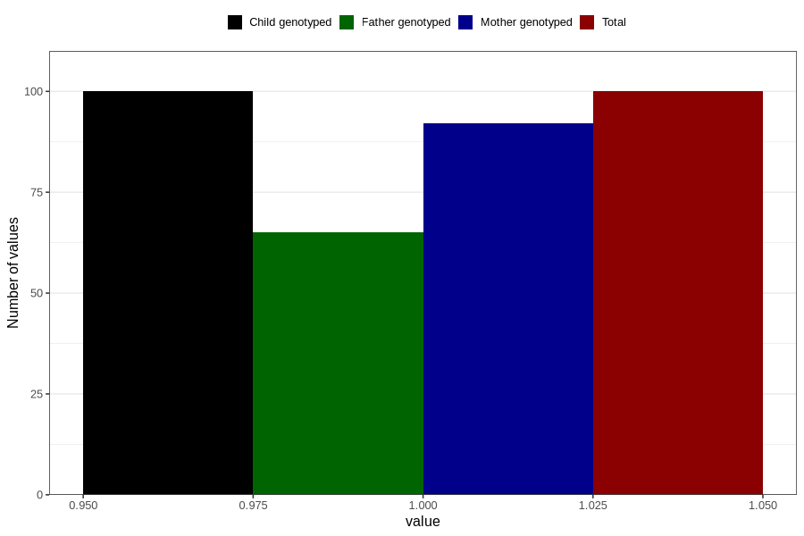

# syndrome_6m
Variable mapping to `DD1110` in `Skjema4_6mnd_v12`.
- Number of values:

| Value | Total | Child genotyped | Mother genotyped | Father genotyped |
| ----- | ----- | --------------- | ---------------- | ---------------- |
| Missing | 80706 | 80706 | 75932 | 53098 |
| Non-missing | 100 | 100 | 92 | 65 |
| 1 | 100 | 100 | 92 | 65 |

